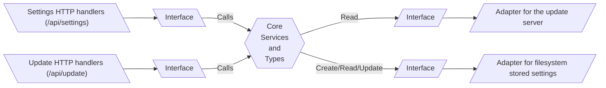
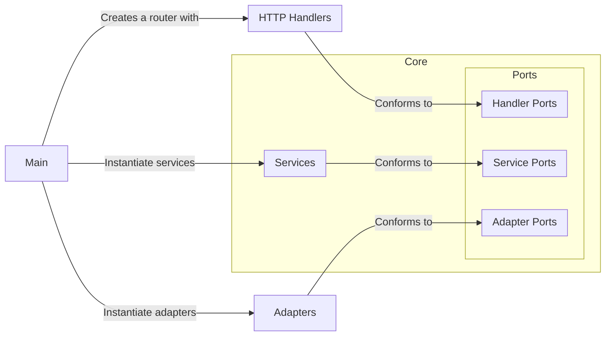

# Architecture

As Vertex is a pretty big project, its architecture is a core concept. It is important to understand this to code features in the right place.

Vertex is using a **port/adapters** architecture (also known as the **hexagonal architecture**), allowing for easy unit testing and decoupling of the different parts. It also allows for reusing the same code in different contexts.

Vertex uses this architecture, but all official apps are also using this architecture.

## Ports and Adapters

Below is a simplified diagram of the Hexagonal architecture, with a subset of Vertex (only the update and settings features).



The core of vertex is where all the main logic is:
- The services (business logic)
- The types (data models)
- The ports (interfaces that the adapters must implement)

The adapters are everything external to the core.
- **Primary adapters** are the entrypoint of the application. They can be anything to interact with the core, like:
    - HTTP handlers
    - CLI commands
    - GUI
    - etc.

  The main advantages is that we can plug any primary adapter to the core, and it will work. For example, we can have a CLI adapter, and an HTTP adapter, and they will both work with the same core.
- **Secondary adapters** are the way the core interacts with the outside world. They can be anything, like:
    - A database
    - A filesystem
    - A web API
    - etc.

  Again, the main advantage is that we can plug any secondary adapter to the core, and it will work. For example, we can have a filesystem adapter, and a database adapter, and they will both work with the same core. This is because each secondary adapter conforms to the same interface.

:::tip TL;DR
- **Primary adapters**: Entrypoint. Responsible for:
    - Handling user interactions.
    - Handling errors coming from the core.
- **Services**: Business logic. Responsible:
    - For the main logic of the application.
    - For validating user input.
    - For returning errors to the primary adapters.
- **Secondary adapters**: External data (database, filesystem, use of external web API, etc.)
    - Responsible for storing and retrieving data.
:::

## Packages hierarchy

Each part of Vertex that defines a port/adapter architecture is structured this way:

```
├── core
│   ├── ports      (interfaces that the adapters must implement)
│   ├── services   (business logic)
│   └── types      (models)
├── handlers       (primary adapters, in this case for HTTP)
├── adapters       (secondary adapters)
```

## Main program

The main program is then responsible to assemble the puzzle:
- It creates the secondary adapters
- It creates the services (and injects the secondary adapters)
- It creates the primary adapters (and injects the services)


