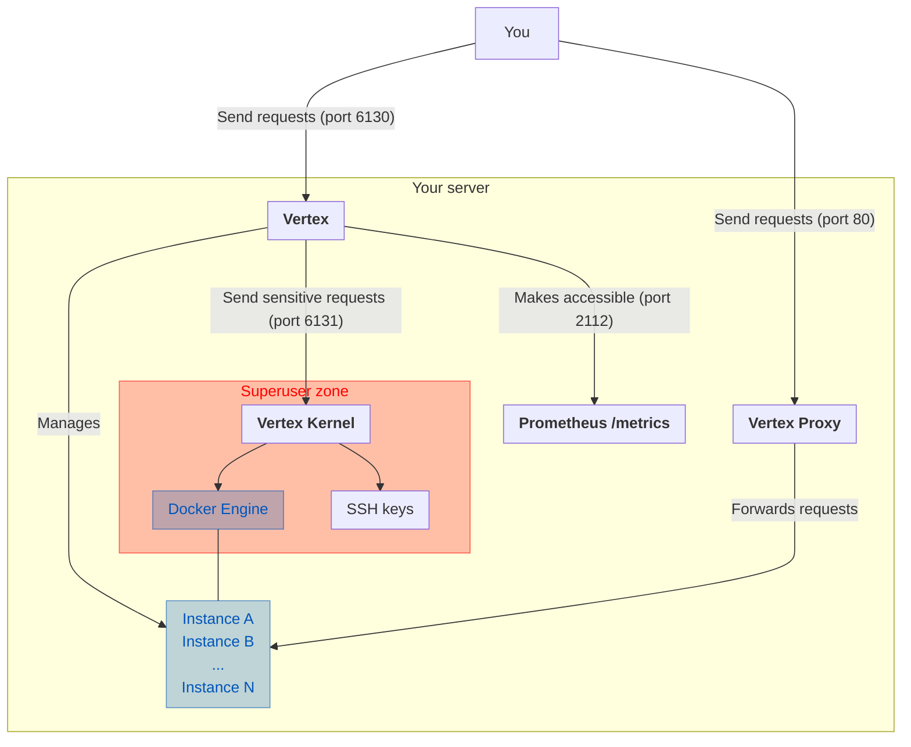

# Vertex Kernel

The Vertex Kernel is a major component of Vertex, that is responsible for running all the tasks that need sudo permissions:
- Managing your SSH keys;
- Managing your Docker containers;
- Allowing vertex to use port 80;
- And finally, running Vertex.

While the **Vertex-Kernel is running as root, Vertex is _not_ running as root**, but as the user you mentioned to the kernel while launching it (with the `--user` flag).

This is done by dropping privileges while launching Vertex.

The Vertex Kernel must **NEVER** be exposed to the internet. It must only be accessible by Vertex.

:::danger
**Please do NOT expose any ports at the moment**, as Vertex Authentication is not yet implemented.

If you want to use Vertex from outside your local network, please install the WireGuard instance and only expose the port 51820.
:::
